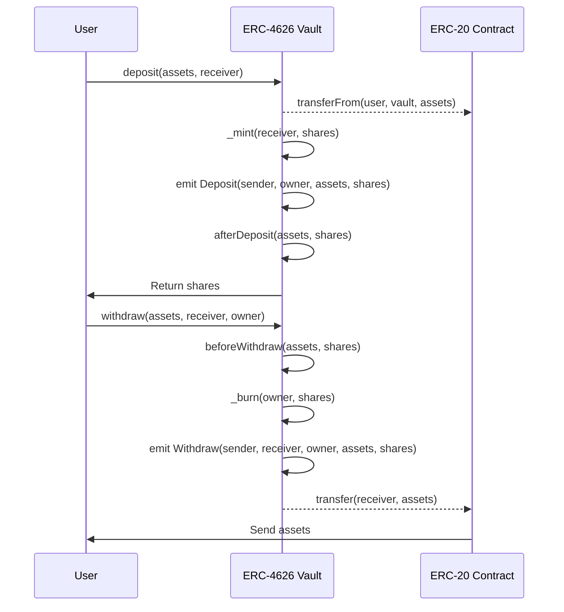

# Beginner's Guide to ERC-4626 Standard

## Introduction to ERC-4626

Imagine you could deposit cryptocurrency into a digital vault and receive tokens representing your share of the vault's total assets. This is exactly what ERC-4626 enables on the Ethereum blockchain. Officially known as the "Tokenized Vault Standard", ERC-4626 provides a unified framework for creating vaults that accept ERC-20 tokens and issues corresponding share tokens to depositors.

## Tokenized Vaults

Understanding asset-to-share conversion in tokenized vaults is crucial to grasping ERC-4626. When you deposit assets into a vault, the number of shares you receive depends on the vault's current exchange rate.

Example: If a vault holds 1,000 USDC and has issued 800 shares, each share represents 1.25 USDC (1,000 ÷ 800 = 1.25). If you deposit 100 USDC, you'll receive 80 shares (100 ÷ 1.25 = 80).
As the vault generates yield, the value per share increases, but the total number of your shares remains the same. This mechanism allows all shareholders to benefit proportionally from the vault's performance.

## Why ERC-4626?

Tokenized vaults are widely used in decentralized finance (DeFi) projects, including lending platforms, yield strategies, and asset management. However, without a standardized approach, each project implements vaults differently.

This lack of uniformity creates challenges for applications like yield aggregators or portfolio managers that must interact with multiple vaults across different protocols. Developers must write custom integration logic for each implementation, increasing development time, introducing potential vulnerabilities, and duplicating effort across projects.

ERC-4626 solves this problem by establishing a standard for tokenized vaults. By defining a consistent interface for deposits, withdrawals, and share calculations, it ensures interoperability between vaults and third-party applications. This standardization reduces integration complexity, minimizes errors, and accelerates innovation by allowing developers to build on a shared foundation.

## Prerequisites

**Mandatory EIP-20 Implementation**

All ERC-4626 vaults must implement the EIP-20 standard for `share` tokens. This includes:

- Basic functions: `balanceOf`, `transfer`, `totalSupply`,etc., operate on the vault “shares” which represent a claim to ownership on a fraction of the vault’s underlying holdings.
- Metadata extensions: The `name` and `symbol` functions should reflect the underlying token’s `name` and `symbol`.
- Non-transferrable vaults may revert on calls to `transfer` or `transferFrom`.

**Optional EIP-2612 Support**

EIP-4626 tokenized vaults may implement EIP-2612 to improve the user experience (UX) of approving shares on various integrations.

## Key Terminologies

| Term                     | Definition                                                                                                                                            |
| ------------------------ | ----------------------------------------------------------------------------------------------------------------------------------------------------- |
| **Yield-bearing Vaults** | Smart contracts designed to optimize the returns on cryptocurrency assets by pooling and strategically allocating them across various DeFi protocols. |
| **Asset**                | The underlying token of the vault with units managed by the corresponding ERC-20 contract.                                                            |
| **Share**                | Tokens received in exchange for assets deposited into the vault, representing ownership shares.                                                       |
| **Fee**                  | Charges applied to operations (deposits, withdrawals, Assets Under Management (AUM), or yield) to the user by the vault.                              |
| **Slippage**             | Difference between expected and actual share pricing during transactions excluding fees.                                                              |

## ERC-4626 Methods

The table below outlines the key functions defined in the ERC-4626, with an explanation of the purpose and return value of each function.

| Method                                                                                       | Purpose                                                                                                                                    |
| -------------------------------------------------------------------------------------------- | ------------------------------------------------------------------------------------------------------------------------------------------ |
| **asset()**                                                                                  | Returns the address of the underlying token used for the vault for accounting, deposits, and withdrawals.                                  |
| **totalAssets()**                                                                            | Returns the total amount of the underlying asset that is managed by the vault.                                                             |
| **convertToShares()**/ **convertToAssets()**                                              | Returns the amount of shares/assets that the vault would exchange for the amount of assets/shares provided respectively.                   |
| **previewDeposit()**/ **previewWithdraw()**/ **previewMint()**/ **previewRedeem()** | Simulates the effects of a deposit/withdrawal/mint/redemption at the current block (with current on-chain conditions) respectively.        |
| **deposit()**                                                                                | Mints vault `shares` to `receiver` by depositing exact amount of underlying tokens.                                                        |
| **maxDeposit()**                                                                             | Returns the maximum amount of the underlying asset that can be deposited into the vault for the `receiver`, through a `deposit` call.      |
| **mint()**                                                                                   | Mints exactly specified `shares` to `receiver` by depositing `assets` of underlying tokens.                                                |
| **maxMint()**                                                                                | Returns the maximum amount of shares that can be minted from the vault for the `receiver`, through a `mint` call.                          |
| **withdraw()**                                                                               | Burns `shares` from `owner` and sends exact `assets` of underlying tokens to `receiver`.                                                   |
| **maxWithdraw()**                                                                            | Returns the maximum amount of the underlying asset that can be withdrawn from the `owner` balance in the vault, through a `withdraw` call. |
| **redeem()**                                                                                 | Burns exactly specified `shares` from `owner` and sends `assets` of underlying tokens to `receiver`.                                       |
| **maxRedeem()**                                                                              | Returns the maximum amount of vault shares that can be redeemed from the `owner` balance in the vault, through a `redeem` call.            |

### Understanding Deposit vs Mint and Withdraw vs Redeem

**Deposit vs Mint**:

- deposit(): You specify how many assets you want to deposit, and the vault calculates how many shares to give you
- mint(): You specify how many shares you want to receive, and the vault calculates how many assets you need to deposit

**Withdraw vs Redeem**:

- withdraw(): You specify how many assets you want to receive, and the vault calculates how many shares to burn
- redeem(): You specify how many shares you want to burn, and the vault calculates how many assets to give you

## ERC-4626 Events

Two key events `Deposit` and `Withdraw` capture the state transitions:

- Deposit: Emitted when a user deposits underlying assets into the vault, receiving an equivalent amount of shares in return. The `sender` initiates the transaction, and the `owner` receives the shares.

- Withdraw: Emitted when shares are redeemed or withdrawn from the vault. The `sender` triggers the withdrawal, converting the `owner`’s shares back into assets, which are then transferred to the `receiver`.

The following state diagram illustrates the flow of asset and share transfers within an ERC-4626-compliant vault.

## Further Reading

- [EIP-4626 Proposal](https://eips.ethereum.org/EIPS/eip-4626)
- [EIP-4626 Github Repo](https://github.com/transmissions11/solmate/blob/main/src/tokens/ERC4626.sol)

## Conclusion

By standardizing the logic, methods, and key token behaviors of yield-bearing vaults, ERC-4626 addresses critical gaps in interoperability and transparency across DeFi protocols. This standardization enables developers to integrate yield strategies more easily into decentralized applications, while improving efficiency across the DeFi ecosystem.
